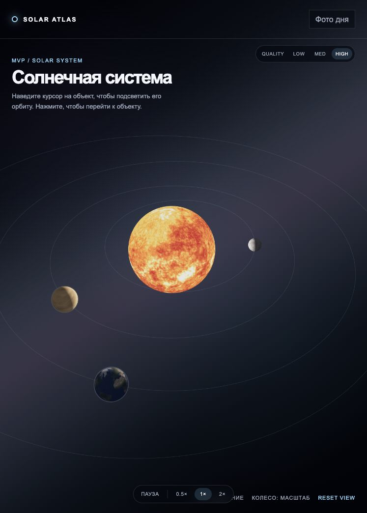

# Solar Atlas

An interactive 3D atlas of the Solar System built with React, TypeScript,
Three.js, and React Three Fiber.

**Live demo:** [aleksey-zhivov.github.io/graphics-spa](https://aleksey-zhivov.github.io/graphics-spa/)



## Features

- interactive 3D overview with camera travel between celestial bodies;
- unified catalogue for stars, planets, dwarf planets, satellites, comets, and
  asteroids;
- physically based orbital periods, eccentricities, rotation directions, and
  axial tilts with documented visual normalization;
- textured planets and satellites, atmospheric glow, and a layered star field;
- route-driven selection with direct links and browser history support;
- pause, time scaling, and low, medium, and high graphics quality modes;
- NASA Astronomy Picture of the Day with cache fallback and explicit loading
  and error states;
- responsive mouse and touch controls;
- unit tests for orbital mathematics and deployment path configuration.

## Stack

- React 19 and TypeScript;
- Vite;
- Three.js, React Three Fiber, and Drei;
- React Router;
- Redux Toolkit and RTK Query;
- SCSS Modules;
- Vitest, ESLint, and Prettier.

Graphics presets have visible rendering differences:

- `Low`: schematic color materials without surface textures or atmosphere;
- `Medium`: textured bodies and the standard atmospheric scene;
- `High`: denser space background, independently moving Earth and Venus
  clouds, a high-resolution solar convection flow, and a pulsing corona.

## Run locally

```bash
npm install
npm run dev
```

Copy the environment example:

```bash
cp .env.example .env.local
```

Available variables:

```dotenv
VITE_NASA_API_KEY=DEMO_KEY
VITE_BASE_PATH=/graphics-spa/
```

Use `VITE_BASE_PATH=/` for a root-domain deployment.

## Quality checks

```bash
npm test
npm run lint
npm run build
npm run format:check
```

## GitHub Pages

The stable version is published from `main`. Active development is performed
in `develop` and merged into `main` after review.

## Roadmap

- add the outer planets and their major satellites;
- add dwarf planets, comets, and the asteroid belt;
- introduce orbit inclinations and date-based positions;
- add scene quality auto-detection and richer body information;
- split the production bundle into route and graphics chunks.

## Project documentation

- [Code style and engineering conventions](./docs/code-style.md)
- [Project architecture](./docs/architecture.md)
- [Scientific model and visualization limits](./docs/scientific-model.md)
